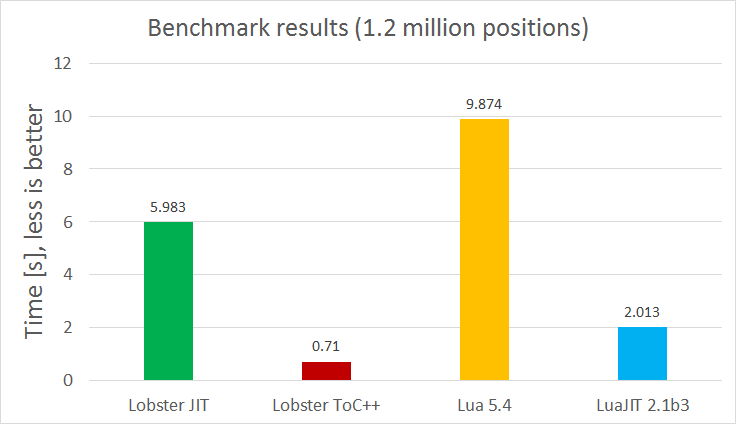

# Tic4
A simple 4x4 Tic Tac Toe playing AI in Lua and Lobster. In addition to four in a row (or column or diagonal), four in a square also win. Other than playing with Lobster as a language, I also wanted to benchmark both languages using constructs that are as equivalent as possible.

Winning conditions:
<p>
o&ensp;.&ensp;.&ensp;.&emsp;&emsp; .&ensp;.&ensp;.&ensp;.<br>
.&ensp;o&ensp;.&ensp;.&emsp;&emsp; .&ensp;o&ensp;o&ensp;.<br>
.&ensp;.&ensp;o&ensp;.&emsp;&emsp; .&ensp;o&ensp;o&ensp;.<br>
.&ensp;.&ensp;.&ensp;o&emsp;&emsp; .&ensp;.&ensp;.&ensp;.<br>
</p>

#### Playing against it
You can run it to play (both the tic4 and negamax files are needed in each language):<br>
```
lua/luajit tic4.lua
lobster tic4.lobster
```

#### Benchmark mode
One can also run it to *benchmark* the languages and implementations by calling<br>
```
lua/luajit tic4.lua bench
lobster tic4.lobster -- bench
```

{:height="50%" width="50%"}
